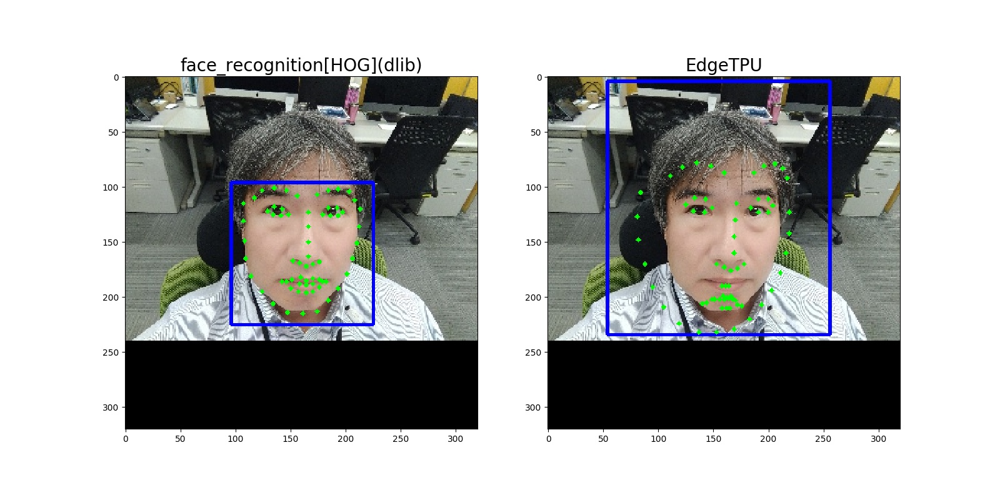
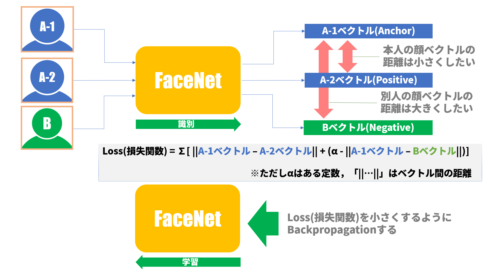
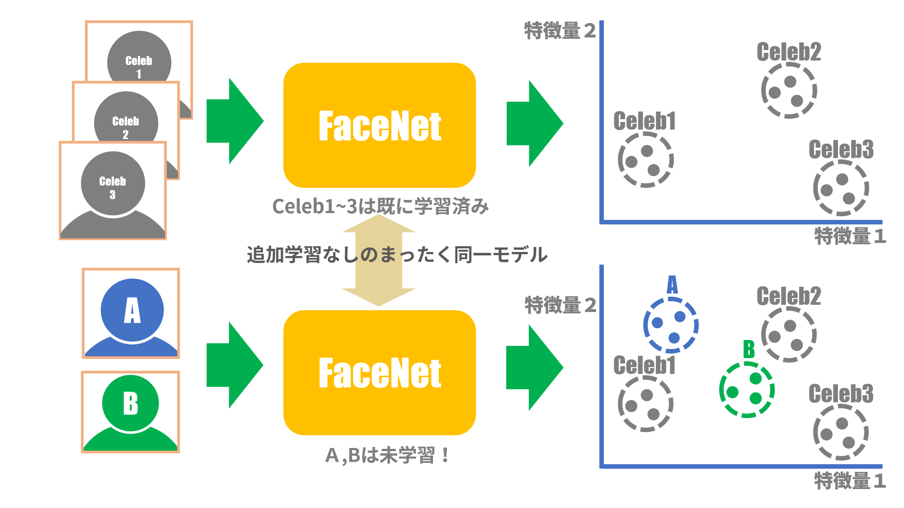

# EdgeTPUで顔認証してみる～方式編その２

## １．今回やること

前回は「Step1: 顔検出」まで実装しました。今回は「Step2 	顔ランドマーク推定」「Step3 	顔アラインメント」を実装してから、「Step4 	顔エンコーディング」を実装しようとしたのですが、試行錯誤の末、以下に説明する理由により手順とその中身が変わります。
今回の内容は方式に関する話がほとんどなので急遽「方式編その２」としました。すみませんが、実装まではちょっと足踏みです。

> 手順（各Step）については前々回の記事[「EdgeTPUで顔認証してみる～方式編」](https://www.soliton-cyber.com/blog/edgetpu)の「EdgeTPU使用の検討」あたりをご参照ください。

## ２．顔ランドマーク推定を試してみたが

### （１）２通りのバウンディングボックスで顔ランドマーク推定
「顔検出」の次は「顔ランドマーク推定」だというわけで教科書的に作業を進めてみました。顔ランドマーク推定の実装はdlibライブラリによるものと、OpenCVライブラリによるものが一般的ですが、前回「顔検出」の実装で用いたものと同様にdlibライブラリを使います。入力画像は[前回記事](https://www.soliton-cyber.com/blog/edgetpu-facedetection1)の「図４：顔検出結果」で用いたものを使いました。
顔検出で算出されるバウンディングボックス（切り出される顔領域）は前回実施された「dlib(face_recognition[HOG])」と「EdgeTPU」の２つの顔検出結果を用いました。既に得られているバウンディングボックスの情報は表１の通りです。両者の位置やサイズはかなり異なります：

<center>
表１：顔検出で算出済みバウンディングボックス情報

|ライブラリ名|バウンディングボックス座標<br>(top, right, bottom, left)|サイズ(横[px]x縦[px])|
|:---|:---|:---|
|dlib(face_recognition[HOG])|(96, 225, 225, 96)|130[px]x130[px]|
|EdgeTPU|(4, 256, 234, 54)|203[px]x231[px]|

</center>

ランドマーク推定結果は図1に示す通りです。左が「dlib(face_recognition[HOG])」による結果、右が「EdgeTPU」による結果です。青線はバウンディングボックス、緑点はランドマークの各点（68点）を示します。


<center>図１：ランドマーク推定結果</center>

左側の「dlib(face_recognition[HOG])」ではうまくランドマーク推定されているようです。しかし、右側の「EdgeTPU」では全体的に外側にふくらむようにランドマークがズレています。残念ながらこれでは次のステップである顔アラインメントに使うことはできません。どうやら、バウンディングボックスの座標がランドマークの計算結果に影響を与えているようです。

原因を調べる前に図１で使ったプログラムを載せておきます。ランドマーク推定計算自体は「dlib.shape_predicator」を呼び出す程度で非常に簡単です。

```python
#!/usr/bin/env python3
# -*- coding: utf-8 -*-

import cv2
import dlib
import matplotlib.pyplot as plt

if __name__ == '__main__':
    # タイトルとバウンディングボックス座標データ：
    data_set = [
        # title: <string>
        # box: <tuple>=(top, right, bottom, left)
        {"title": "dlib(face_recognition[HOG])", "box": (96, 225, 225, 96)},
        {"title": "EdgeTPU", "box": (4, 256, 234, 54)}
    ]

    # リサイズされた画像[320x320]の読み込み
    IMAGE_PATH = "./P_20201023_142737_BF_resized_320x320.jpg"
    image = cv2.imread(IMAGE_PATH, cv2.IMREAD_COLOR)
    
    # ランドマーク推定の準備
    MODEL_PATH = "./shape_predictor_68_face_landmarks.dat"
    predictor = dlib.shape_predictor(MODEL_PATH)
    image_gray = cv2.cvtColor(image, cv2.COLOR_BGR2GRAY)

    # 結果画像表示の準備
    rows = 1
    cols = 2
    icount = 1
    plt.figure(figsize=(16, 8))		# figsize=(横サイズ[inch], 縦サイズ[inch])

    landmarked_set = []
    for data in data_set:
        cimage = image.copy()

        # バウンディングボックス座標の読み込み
        (top, right, bottom, left) = data['box']

        # バウンディングボックスの描画
        cv2.rectangle(cimage, (left, top), (right, bottom), (255,0,0), 2)

        # ランドマーク推定の計算
        landmark = predictor(image_gray, dlib.rectangle(left, top, right, bottom))
        for point in landmark.parts():
            # ランドマーク点の描画
            cv2.circle(cimage, (point.x, point.y), 2, (0, 255, 0) , -1)

        # 結果画像の描画
        cimage = cv2.cvtColor(cimage, cv2.COLOR_BGR2RGB)
        plt.subplot(rows, cols, icount)
        plt.title(data['title'], fontsize=20)
        plt.imshow(cimage)
        icount += 1

    # 結果画像の表示
    plt.show()
```

以下は注釈です：
> * 18行目：前回記事の「図４：顔検出結果」で用いたリサイズ後画像（幅:320[px]×高さ:320[px]）ファイルを指定します。

> * 22行目：MODEL_PATHにはdlibのランドマーク（68点）推定用モデル「[shape_predictor_68_face_landmarks.dat](http://dlib.net/files/shape_predictor_68_face_landmarks.dat.bz2)」を指定します。ダウンロードしたファイルはbz2で圧縮されているのでbunzip2等で解凍してください。

> * 30行目：figsize=(横, 縦)で表示画像のサイズを指定しますが、単位はインチ(inch)であることに注意。

> * 43行目：ここがランドマーク推定計算の肝です。第１引数には画像オブジェクトを指定しますが、RGBでもグレースケールでもOKです[[1]](http://dlib.net/python/index.html#dlib.shape_predictor)。後者の方が少し早いかも。第２引数はバウンディングボックス座標を指定しますが、これは「dlib.rectangle」オブジェクトに変換しておく必要があります。

> * 49行目：これはお約束の範疇ですが、OpenCVライブラリでは画像を「BGR」で扱っているので、matplotlibで画像を表示する場合は「RGB」に変換しておきます。

> * 50行目：matplotlibで２枚の画像を横に並べるための設定（縦(rows):1[行]×横(cols):2[列]）です。icountで１枚目、２枚目を指定します。

参考文献：  
[1] [class dlib.shape_predicator](http://dlib.net/python/index.html#dlib.shape_predictor)

### （２）EdgeTPUバウンディングボックスでうまくいかない理由

なぜかネット上ではこの手の話題は非常に少ないのですが、dlibの本家本元GitHubに「Having difficulties on selecting bound box for shape_predictor #2093」[[2]](https://github.com/davisking/dlib/issues/2093)というissueがありました。問題点は「iOS検出器＋shape_predictorを使用すると、品質と速度は良好ですが、一部の画像ではランドマークが見つからず...」というものです。これに対して、dlib作者であるDavis E. Kingさんから以下の解決方法が示されていました：

> You fundamentally need to train using the same kind of data you will use when you really run the model. <span style="color:red">So whatever process you use to generate bounding boxes needs to be the same for training data generation and for model use after training.</span> If it's not the same then it won't work and this is what happens.

> 基本的には、実際にモデルを実行するときに使用するのと同じ種類のデータを使ってトレーニングを行う必要があります。<span style="color:red">つまり、バウンディングボックスを生成するプロセスは、トレーニングデータの生成時とトレーニング後のモデルの使用時に同じである必要があります。</span>もし同じでなければ、うまくいかず、このような結果になります。

dlibのランドマーク推定は機械学習に基づく方式です。この回答に従えば、EdgeTPUで正しいランドマークを得るには、上記プログラムで使われたモデル「shape_predictor_68_face_landmarks.dat」をEdgeTPUのバウンディングボックスを用いて再学習するということになります。

また、この回答は以下の単純なことを示唆しています。つまり：

```
機械学習モデル使用時に入力されるデータは、学習時に用いたデータと作成条件を合わせなければならない。
```
ということです。たいていの人はdlibのランドマーク推定にはdlibの顔検出を使い、OpenCVのランドマーク推定にはOpenCVの顔検出を使っているのであまり問題が顕在化しなかったと思われます。

参考文献：  
[2] [GitHub davisking/dlib "Having difficulties on selecting bound box for shape_predictor #2093"](https://github.com/davisking/dlib/issues/2093)

### （３）手順の再検討

と、ここで気付いたのは「Step4. 顔エンコーディング (Face Encoding)」にはニューラルネットによるモデルを使う予定であり、それはまぎれもなく機械学習モデルであるということです。学習時に用いた画像の条件は、最初に顔エンコーディングのためのモデルを決めなければはっきりしないため、それまでは学習後にモデルに入力される画像の条件もはっきりしないということになります。そこで、ここからは作業の順序を変えます。まず、以下のモデルを選定します。

* Step4. 顔エンコーディング (Face Encoding)

次に選定されたモデルの学習に用いられた画像の条件を調べた後、以下の方式を決定します。

* Step1. 顔検出 (Face Detection)
* Step2. 顔ランドマーク推定 (Face Landmark Estimation)
* Step3. 顔アラインメント (Face Alignment)

というわけで、せっかく試した顔検出や顔ランドマーク推定はいったん脇に置いておきます。

## ３．顔エンコーディング (Face Encoding)モデルの決定

### （１）FaceNetに決定

すみません、最初から「FaceNet」に決めていました。「FaceEet」[[3]](https://arxiv.org/abs/1503.03832)は2015年に登場したモデルでいささか古くはなっていますが、性能も良く、よく知られているので実装例も多いです。EdgeTPUに載せるための改造には適していると思われます。

先日、ネットで「6 Best Open-Source Projects for Real-Time Face Recognition」[[4]](https://hackernoon.com/6-best-open-source-projects-for-real-time-face-recognition-vr1w34x5)という記事を見つけました。この記事では顔認識のためのお奨めプロジェクトが紹介されています。最新・最高精度のものとして「InsightFace」が紹介されてはいるものの、「FaceNet」もそれに伍する感じで紹介されています。思ったよりも時代遅れのものでもなさそうです。

参考文献：  
[3] [FaceNet: A Unified Embedding for Face Recognition and Clustering](https://arxiv.org/abs/1503.03832)  
[4] [6 Best Open-Source Projects for Real-Time Face Recognition ](https://hackernoon.com/6-best-open-source-projects-for-real-time-face-recognition-vr1w34x5)  

### （２）FaceNetの作り方とその働きについて

実装には直接関係ないのですが、FaceNetの作り方とその働きを理解しておいた方がプログラムも理解しやすいので、ここで簡単に説明しておきます。

FaceNetの作り方は、まず３枚の写真を用意します。１枚は本人の写真（これを「Anchor」と呼びます）、次に本人の別の写真（これを「Positive」と呼びます）、さらに別人の写真（これを「Negative」と呼びます）です。図２では、各々写真A-1、写真A-2、写真Bに対応します。各写真をFaceNetに入力すると、それぞれの埋め込みベクトル(Embedding vector)が得られます。FaceNetでは128次元のベクトルを生成します。

FaceNetもディープラーニングのモデルなので損失関数が定義されます。通常のディープラーニングのモデルでは教師信号と出力信号の差分や交差エントロピーを最小にするような損失関数が定義されますが、FaceNetのそれはちょっと特殊です。つまり、
```
「本人同士の埋め込みベクトル間の距離は小さく、本人と別人の埋め込みベクトル間の距離は大きくする」
```
という性質の損失関数（Triplet Lossと呼ばれます、図２参照）が定義されます。ですので、１回の損失関数を計算するには３枚の写真をモデルに通す必要があります。学習はこの損失関数（Triplet Loss）の値が減少するようにニューロンの重みを更新していきます（＝Backpropagation）。実際の学習ではこの３枚組写真の決め方が「肝」で、適切な組を何十万（もっとかも）と用意して学習します。


<center>図２：FaceNetの学習</center>

ここで強調しておきたいのは、FaceNetはAさん、Bさん個々の顔を学習しているというよりも、<span style="color:red">「同一人物は近く、別人は遠く」という性質を学習している</span>ということです。この性質によって、FaceNetは今まで学習したことのない顔でも、埋め込みベクトル空間上でそれっぽいグループの埋め込みベクトルを生成することができます。

例えば、FaceNetを数百万枚のセレブ画像で学習済みだとします。図３の上半分は、学習で用いられたセレブの別画像を入力した場合、埋め込みベクトルの特徴空間では各々のセレブでグループ分けされた埋め込みベクトルの様子を表しています。学習済みなんだから当然とも言えます。一方、図３の下半分は入力画像として学習で使われたセレブとは無関係のAさん、Bさんの画像を用いた場合です。FaceNetはAさん、Bさんの顔を学習したことがなくても、埋め込みベクトルの特徴空間ではAさん、Bさんのグループ分けを行い、セレブグループとも重なりません。

これによって、FaceNetで識別される人数を増やしたい場合、新たにFaceNetを再学習する必要はないことがわかります。


<center>図３：FaceNetの働き</center>

FaceNetについては機会を改めて説明したいと思いますが、今のところはこれくらいの理解で十分です。


### （３）FaceNetの学習済みモデルを探す

前節で説明したように、一からFaceNetモデルを学習するのは大変そうなので、例によって学習済みのモデルを探します。
FaceNetプロジェクトの有名どころをいくつか挙げてみます。

#### Keras OpenFace[[5]](https://github.com/iwantooxxoox/Keras-OpenFace)

OpenFaceはPyTorchベースのディープラーニングフレームワークを使用してFaceNetを実装しています。
Keras-OpenFaceはOpenFaceをKerasにポーティングしたものです（EdgeTPUに載せるには少なくともTensorflow/Kerasで実装されていることが必要）。
学習済みのモデルは４種類あるようです[[6]](https://cmusatyalab.github.io/openface/models-and-accuracies/)。
学習に用いたデータセットはFaceScrub[[7]](http://vintage.winklerbros.net/facescrub.html)等で、既に顔画像として切り取られた画像をデータセットとして用いていました。このデータセットは顔画像切り出しの条件がはっきりしないため、我々のカメラ画像から顔画像を切り出す方法もわからず、使用を断念しました。

#### FaceNet by David Sandberg[[8]](https://github.com/davidsandberg/facenet)

Tensorflowで実装されたFaceNetです。顔検出にMTCNN[[9]](https://github.com/ipazc/mtcnn)を用いています。MTCNNはディープラーニングのモデルが使われているため、MTCNNモデルをEdgeTPUに載せるという手間が発生してしまいます。よってこれもパスです。

#### FaceNet by Hiroki Taniai [[10]](https://github.com/nyoki-mtl/keras-facenet)

すぐに使用できる学習済みのKeras FaceNetモデルが提供されています。学習に用いられたデータセットはMS-Celeb-1M[[11]](https://www.microsoft.com/en-us/research/project/ms-celeb-1m-challenge-recognizing-one-million-celebrities-real-world/)ですが、これは現在使用することはできません。しかし、このプロジェクトではデモプログラムが用意されていて、顔画像切り出しの条件がプログラム中にはっきり明記されています。よって、このモデルを使うこととします。以下の節では「顔画像切り出しの条件」の詳細を説明します。

参考文献：  
[5] [GitHub iwantooxxoox/Keras-OpenFace ](https://github.com/iwantooxxoox/Keras-OpenFace)  
[6] [OpenFace-DNN Models-Models and Accuracies](https://cmusatyalab.github.io/openface/models-and-accuracies/)  
[7] [NUS FaceScrub](http://vintage.winklerbros.net/facescrub.html)  
[8] [GitHub davidsandberg/facenet ](https://github.com/davidsandberg/facenet)  
[9] [GitHub ipazc/mtcnn](https://github.com/ipazc/mtcnn)  
[10] [GitHub nyoki-mtl/keras-facenet ](https://github.com/nyoki-mtl/keras-facenet)  
[11] [MS-Celeb-1M](https://www.microsoft.com/en-us/research/project/ms-celeb-1m-challenge-recognizing-one-million-celebrities-real-world/)  

## ４．手順の変更

### （１）画像前処理

モデルとして「FaceNet by Hiroki Taniai [[10]](https://github.com/nyoki-mtl/keras-facenet)」によるモデルを使用することに決まりましたが、このモデルに入力する画像の前処理として以下の処理があることが判明しました：

#### (1)  OpenCV：「Haar-like特徴分類器」による顔検出

「Haar-like特徴を用いたブースティングされた分類器のカスケード[[12]](http://opencv.jp/opencv-2svn/py/objdetect_cascade_classification.html)」と呼ばれる方式ですが、XML形式のモデルファイルを用いた顔検出です。実際に試してみると顔検出の性能は今一つで、バウンディングボックスの誤検出が多発しやすく、顔の向きや傾きにも敏感でちょっとした姿勢の変化でも顔検出されないことが多いです。
しかしながら、顔検出の方式として明確に指定されているので、以前に試したEdgeTPUによる顔検出は今回は使わないことになります（残念）。

#### (2) リサイズ

顔検出した領域（バウンディングボックス）の上下左右に５ピクセルのマージンを加えて、元画像から切り出します。切り出した画像をリサイズして画像サイズを160[px] x160[px]にします。上記顔検出によるバウンディングボックスは常に正方形なので、パディング等の操作は必要ありません。ついでに、画素の数値が0～255の整数だったものを0～1の実数へ比例的に変換します。

#### (3) 標準化(standardization)

元画像の各ピクセルデータの平均を0、標準偏差を1へと変換する標準化法です。これにより、極端に明るい画像、暗い画像、極端にコントラストが強い画像、弱い画像が補正されます。元画像はRGB各色の３画像平面を持っているので、３画像平面すべてを合わせた平均、標準偏差を求め、以下の式で標準化されたピクセルデータを計算します：

$$
\begin{align*}
 x_{standardized} = \frac{x - \mu}{\sigma}\\
 \mu:平均，\sigma：標準偏差
 \end{align*}
$$

ちなみに、上記（１）～（３）の画像前処理は、「FaceNet by Hiroki Taniai」プロジェクトにおいて学習に用いた画像データに対してたまたまこのような前処理を行ったということであり、このモデルを使う場合にも同様な前処理が必要ということです。つまり、FaceNetが求める要件ではありません。

参考文献：  
[12] [OpenCV：カスケード型分類器](http://opencv.jp/opencv-2svn/py/objdetect_cascade_classification.html)

### （２）顔アラインメント

顔アラインメントについては当初、最低でも顔を回転させて正立させることを考えていました。しかし、FaceNet論文[[3]](https://arxiv.org/abs/1503.03832)の「SUMMARY」を読んでみると以下の件（くだり）があります：

> Another strength of our model is that it only requires minimal alignment (tight crop around the face area). [17], for example, performs a complex 3D alignment. We also experimented with a similarity transform alignment and notice that this can actually improve performance slightly. It is not clear if it is worth the extra complexity.

> このモデルのもう一つの強みは、最小限の位置合わせ（顔領域のタイトクロップ）しか必要としないことです。例えば、[17]では、複雑な3Dアラインメントを行っています。また、類似性変換によるアラインメントも試してみましたが、これは実際にパフォーマンスをわずかに向上させるだけということに気づきました。しかし、その複雑さに見合うだけの価値があるかどうかは不明です。

これによればFaceNetの場合、画像一杯に顔が写っていればよく、少々顔が傾いていても、少々斜め向きでも、あまり顔認識には影響しないと読めます。また、前段の「Haar-like特徴分類器」による顔検出において条件の良い画像しか検出されないので、FaceNetへ入力される画像は特に補正の必要無しと思われます。したがって、今回は顔アラインメントについては実施せずとします。

### （３）手順の変更

以上を鑑みて、変更後の手順を表２にまとめます：

<center>
表２：変更後の手順

|Step|処理名|変更前|変更後|
|:---|:---|:---:|:---:|
|Step1|顔検出|EdgeTPU:DeepLearningモデル|OpenCV:Haar-like特徴分類器|
|Step2|顔ランドマーク推定|dlib or OpenCVライブラリ|なし|
|Step3|顔アラインメント|dlib or OpenCVライブラリ|なし|
|Step4|顔エンコーディング|未定|FaceNet（前処理付き）|
|Step5|顔分類|dlib or OpenCVライブラリ|dlib or OpenCVライブラリ|

</center>

## ５．続きは？

実装を期待されていた方には申し訳ありませんが、次回までお待ちください。
結局、顔認識(Face Recognition)のモデルは「FaceNet」と決まりました。FaceNetの性質上、学習済みモデルを使うことで追加学習無しで使えることも判明し、最難関であろうモデル作り（＝自前の学習作業）は回避されました。
次回は、実際に新たな「顔」をモデルに入力しても正しくグループ化された埋め込みベクトルが出力されるかを確認した後、EdgeTPUへの搭載を試みます。

